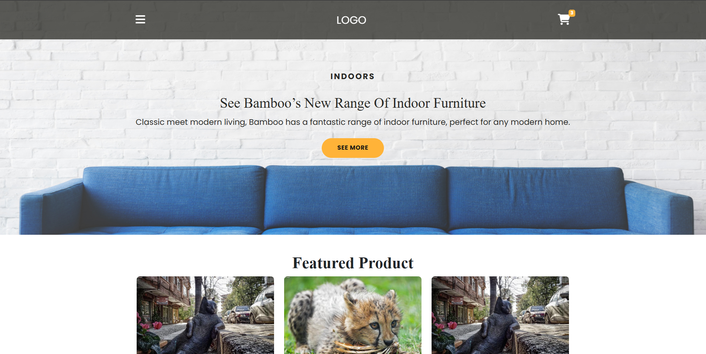
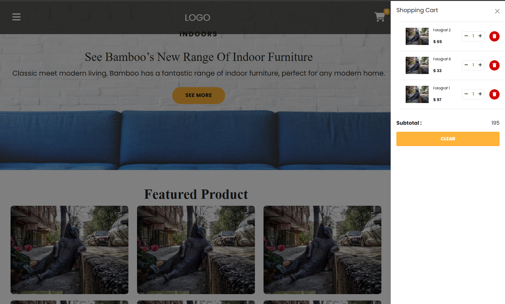

# Shopping Cart Project

This is a shopping cart application built using HTML, CSS, and JavaScript. It fetches product data from a mock API and allows users to add items to their cart, view the cart content, and manage cart items.

---

## Features
- **Product Display**: Dynamically fetch and display products from a mock API.
- **Add to Cart**: Users can add products to the cart.
- **Cart Management**: Includes functionalities like clearing the cart and removing items.
- **Responsive Design**: Optimized for different screen sizes.

---

## Technologies Used
- **HTML**: For the structure of the application.
- **CSS**: For styling and layout.
- **JavaScript**: For dynamic content and interactivity.
- **Mock API**: Simulated backend for product data.

---

## How to Run
1. Clone this repository:
   ```bash
   git clone https://github.com/your-username/shopping-cart.git
   ```
2. Navigate to the project folder:
   ```bash
   cd shopping-cart
   ```
3. Open `index.html` in any web browser to run the application.

---

## File Structure
```
shopping-cart/
│
├── index.html      # Main HTML file
├── style.css       # CSS for styling the shopping cart
├── script.js       # JavaScript functionality
├── images/         # Product images
├── .gitignore      # Files to ignore
└── README.md       # Project documentation
```

---

## Demo


---

## Contributing
Contributions are welcome! To contribute:
1. Fork the repository.
2. Create a new branch:
   ```bash
   git checkout -b feature-name
   ```
3. Commit your changes:
   ```bash
   git commit -m "Add feature-name"
   ```
4. Push your branch:
   ```bash
   git push origin feature-name
   ```
5. Open a pull request.


